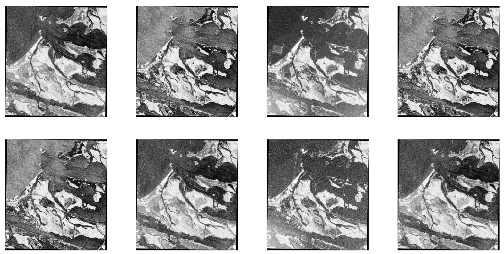

# A Deep-Based Approach for Multi-Descriptor Feature Extraction: Applications on SAR Image Registration #


R2D2 for SAR images
-----------------
This repository contains the code needed to train and extract [Fast-R2D2](https://github.com/naver/r2d2) keypoints for SAR images. The data used for training are SAR images from [this](https://www.kaggle.com/datasets/javidtheimmortal/sar-patches) dataset:




License
-------

Our code is released under the Creative Commons BY-NC-SA 3.0 (see [LICENSE](LICENSE) for more details), available only for non-commercial use.


Getting started
---------------
You just need Python 3.6+ equipped with standard scientific packages and PyTorch1.1+.
Typically, conda is one of the easiest way to get started:
```bash
conda install python tqdm pillow numpy matplotlib scipy
conda install pytorch torchvision cudatoolkit=10.1 -c pytorch
```
<!-- 

Pretrained models
-----------------
For your convenience, we provide five pre-trained models in the `models/` folder:
 - `r2d2_WAF_N16.pt`: this is the model used in most experiments of the paper (on HPatches `MMA@3=0.686`). It was trained with Web images (`W`), Aachen day-time images (`A`) and Aachen optical flow pairs (`F`)
 - `r2d2_WASF_N16.pt`: this is the model used in the visual localization experiments (on HPatches `MMA@3=0.721`). It was trained with Web images (`W`), Aachen day-time images (`A`), Aachen day-night synthetic pairs (`S`), and Aachen optical flow pairs (`F`).
 - `r2d2_WASF_N8_big.pt`: Same than previous model, but trained with `N=8` instead of `N=16` in the repeatability loss. In other words, it outputs a higher density of keypoints. This can be interesting for certain applications like visual localization, but it implies a drop in MMA since keypoints gets slighlty less reliable.
 - `faster2d2_WASF_N16.pt`: The Fast-R2D2 equivalent of r2d2_WASF_N16.pt
 - `faster2d2_WASF_N8_big.pt`: The Fast-R2D2 equivalent of r2d2_WASF_N8.pt
  
For more details about the training data, see the dedicated section below.
Here is a table that summarizes the performance of each model:

|    model name    | model size<br>(#weights)| number of<br>keypoints |MMA@3 on<br>HPatches|
|------------------|:-----------------------:|:----------------------:|:------------------:|
|`r2d2_WAF_N16.pt`    | 0.5M                    | 5K                     | 0.686              |
|`r2d2_WASF_N16.pt`   | 0.5M                    | 5K                     | 0.721              |
|`r2d2_WASF_N8_big.pt`| 1.0M                    | 10K                    | 0.692              |
|`faster2d2_WASF_N8_big.pt`| 1.0M                    | 5K                    | 0.650              |
<!--|`r2d2_WASF_N8_big.pt`| 1.0M                    | 5K                     | 0.704              |-->

 -->
Feature extraction
------------------
To extract keypoints for a given image, simply execute:
```bash
python extract.py --model models/r2d2_WASF_N16.pt --images imgs/brooklyn.png --top-k 5000
```
This also works for multiple images (separated by spaces) or a `.txt` image list. 
For each image, this will save the `top-k` keypoints in a file with the same path as the image and a `.r2d2` extension. 
For example, they will be saved in `imgs/brooklyn.png.r2d2` for the sample command above.

The keypoint file is in the `npz` numpy format and contains 3 fields: 
 - `keypoints` (`N x 3`): keypoint position (x, y and scale). Scale denotes here the patch diameters in pixels.
 - `descriptors` (`N x 128`): l2-normalized descriptors.
 - `scores` (`N`): keypoint scores (the higher the better). 
 
*Note*: You can modify the extraction parameters (scale factor, scale range...). Run `python extract.py --help` for more information. 
By default, they corespond to what is used in the paper, i.e., a scale factor equal to `2^0.25` (`--scale-f 1.189207`) and image size in the range `[256, 1024]` (`--min-size 256 --max-size 1024`). 

*Note2*: You can significantly improve the `MMA@3` score (by ~4 pts) if you can afford more computations. To do so, you just need to increase the upper-limit on the scale range by replacing `--min-size 256 --max-size 1024` with `--min-size 0 --max-size 9999 --min-scale 0.3 --max-scale 1.0`.

<!-- Feature extraction with kapture datasets
------------------
Kapture is a pivot file format, based on text and binary files, used to describe SFM (Structure From Motion) and more generally sensor-acquired data.

It is available at https://github.com/naver/kapture.
It contains conversion tools for popular formats and several popular datasets are directly available in kapture.

It can be installed with:
```bash
pip install kapture
```

Datasets can be downloaded with:
```bash
kapture_download_dataset.py update
kapture_download_dataset.py list
# e.g.: install mapping and query of Extended-CMU-Seasons_slice22
kapture_download_dataset.py install "Extended-CMU-Seasons_slice22_*"
```
If you want to convert your own dataset into kapture, please find some examples [here](https://github.com/naver/kapture/blob/master/doc/datasets.adoc).

Once installed, you can extract keypoints for your kapture dataset with:
```bash
python extract_kapture.py --model models/r2d2_WASF_N16.pt --kapture-root pathto/yourkapturedataset --top-k 5000
```

Run `python extract_kapture.py --help` for more information on the extraction parameters. 
 -->
Training the model
------------------
We provide all the code and data to retrain the model as described in the paper.
Check out the training notebook in kaggle [here](https://www.kaggle.com/code/javidtheimmortal/r2d2-for-sar)
<!-- 
### Downloading training data ###
The first step is to download the training data. 
First, create a folder that will host all data in a place where you have sufficient disk space (15 GB required).
```bash
DATA_ROOT=/path/to/data
mkdir -p $DATA_ROOT
ln -fs $DATA_ROOT data 
mkdir $DATA_ROOT/aachen
```
Then, manually download the [Aachen dataset here](https://drive.google.com/drive/folders/1fvb5gwqHCV4cr4QPVIEMTWkIhCpwei7n) and save it as `$DATA_ROOT/aachen/database_and_query_images.zip`.
Finally, execute the download script to complete the installation. It will download the remaining training data and will extract all files properly.
```bash 
./download_training_data.sh
```
The following datasets are now installed:

| full name                       |tag|Disk |# imgs|# pairs| python instance                |
|---------------------------------|---|-----|------|-------|--------------------------------|
| Random Web images               | W |2.7GB| 3125 |  3125 | `auto_pairs(web_images)`       |
| Aachen DB images                | A |2.5GB| 4479 |  4479 | `auto_pairs(aachen_db_images)` |
| Aachen style transfer pairs     | S |0.3GB| 8115 |  3636 | `aachen_style_transfer_pairs`  |
| Aachen optical flow pairs       | F |2.9GB| 4479 |  4770 | `aachen_flow_pairs`            |

Note that you can visualize the content of each dataset using the following command:
```bash
python -m tools.dataloader "PairLoader(aachen_flow_pairs)"
```

 --><!-- 

### Training details ###
To train the model, simply run this command:
```bash
python train.py --save-path /path/to/model.pt 
```
On a recent GPU, it takes 30 min per epoch, so ~12h for 25 epochs. 
You should get a model that scores `0.71 +/- 0.01` in `MMA@3` on HPatches (this standard-deviation is similar to what is reported in Table 1 of the paper). 

If you want to retrain fast-r2d2 architectures, run:
```bash
python train.py --save-path /path/to/fast-model.pt --net 'Fast_Quad_L2Net_ConfCFS()'
```

Note that you can fully configure the training (i.e. select the data sources, change the batch size, learning rate, number of epochs etc.). One easy way to improve the model is to train for more epochs, e.g. `--epochs 50`. For more details about all parameters, run `python train.py --help`.
 -->